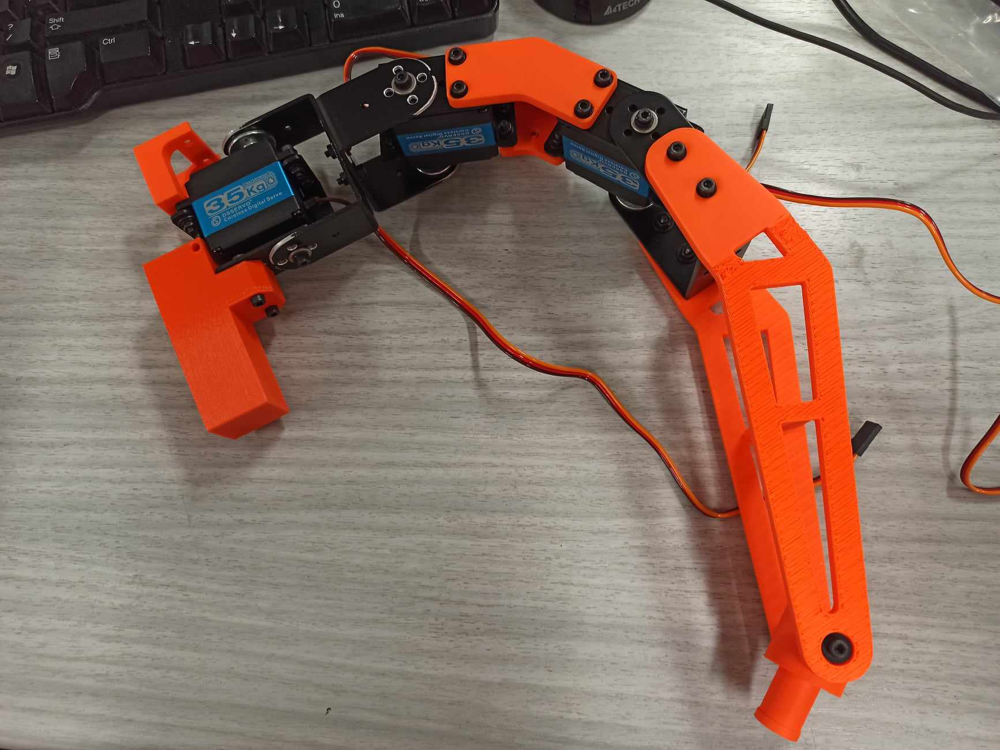
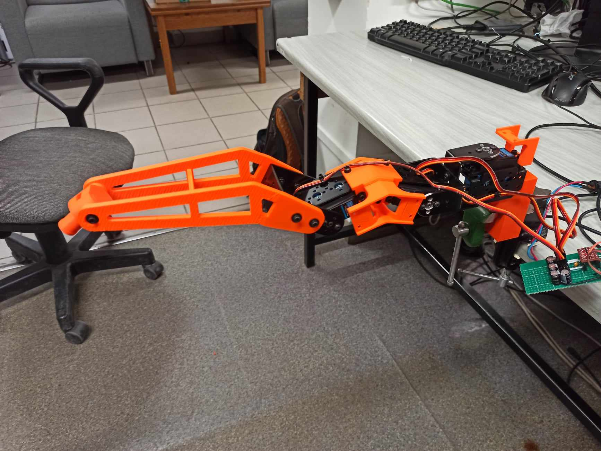

# Elkapod 

## 6-legged robot from WUT

While legs as a form of transportation are quite common in the nature, in robotics they are less popular, due to a good deal of obstacles. However they offer significantly more possibilities when it comes to traversable terrain.

Despite expected chellanges that, we decided to design and develop our very own, fully operational robot. Currently our project consists of seven members tirelessly working on achievieng this goal. We are divided into three teams:

1. Mechanics - using CAD tools and 3D printing, they design and produce all elements necessary Elkapod's body.
2. Electronics - they are the ones responsible for safeand efficient circuits powering all computers, sensors and servomechanisms.
3. Programming - From microcontrollers through simulation to robot system design, they do everything there.

## What we've got
As for today we have reliable working leg, that acts as learning tool for every team. Right now we are in the process of developing a robot's body that would join all upcomming legs and store necessary electronics. 

## Simulation
Advancements from the programming team shouldn't be limited by the challanges from the other teams, thus we are crating a working simulation enviroment in Webots. It's a great tool to develop and test systems and algorithms without actual hardware. Also it reduces wear and damages of fragile components.

## Future
Just building a robot tha can stand and walk when commanded isn't the end of our road. We intend to further refine all the elements, create platform for additional modules and equip it with more electronics allowing to push the boundries of its autonomous behaviour.

## Contact
We are part of robotics science club Bionik

email: hexapod.bionik@gmail.com
